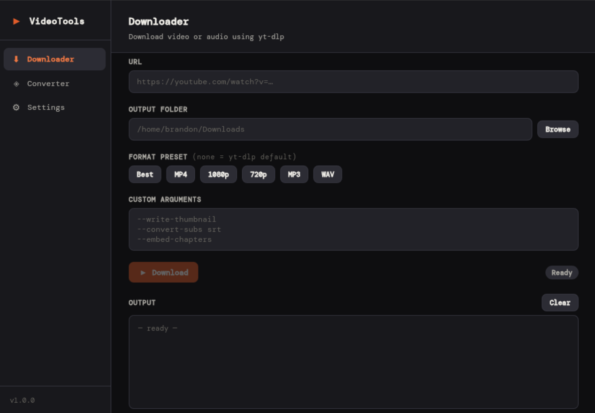
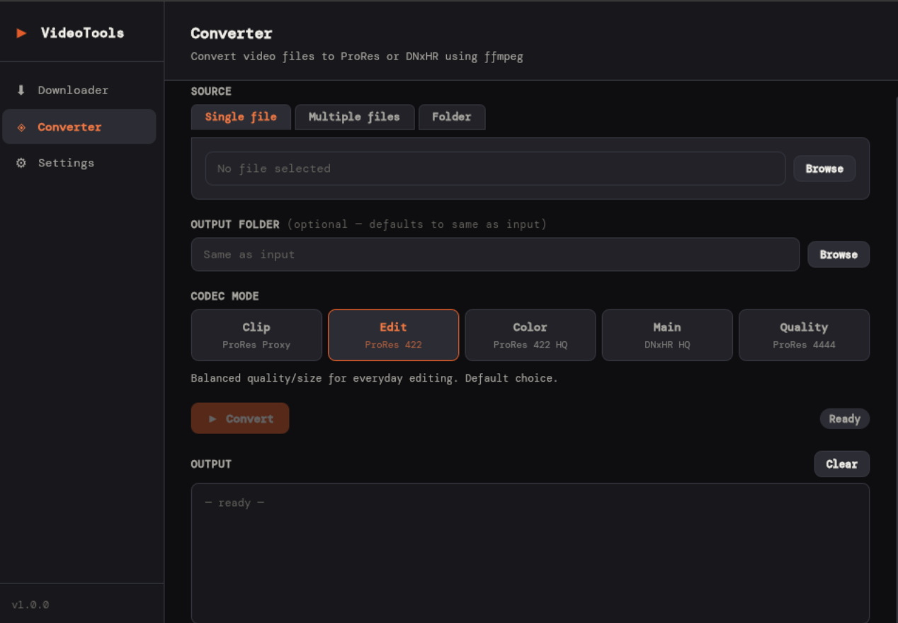
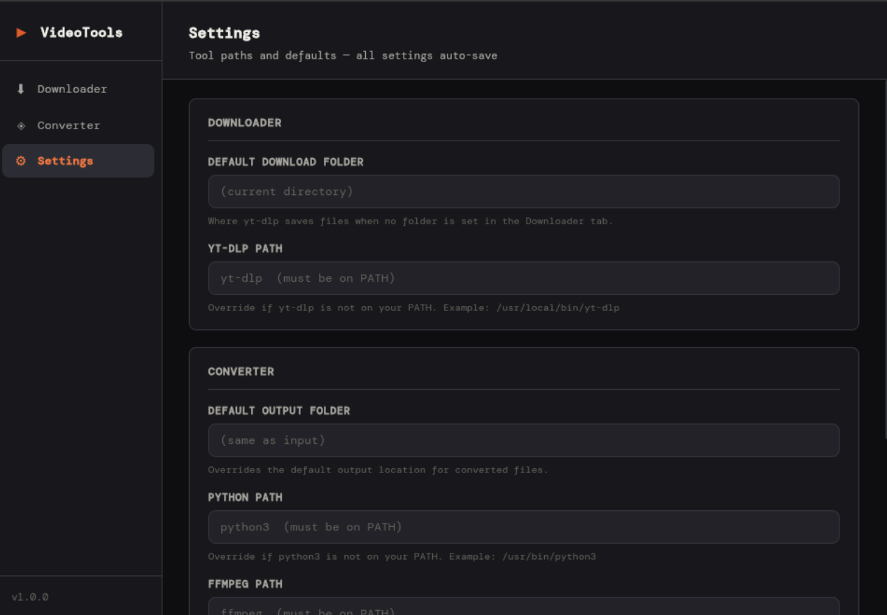

# VideoTools

## Features

### Downloader

- Paste any URL supported by yt-dlp (YouTube, Vimeo, Twitter/X, SoundCloud, etc).
- Choose an output folder via folder picker.
- Six format presets: `Best`, `MP4`, `1080p`, `720p`, `MP3`, `WAV`.
- Custom arguments textarea for any yt-dlp flag (--write-thumbnail, --convert-subs srt, --embed-chapters, etc).
- Live scrolling log output showing download progress and errors.
- Cancel button to kill an in-progress download.
- Status indicator (`Ready` / `Downloading` / `Done` / `Error`).



### Converter

- Convert video files to professional editing codecs using ffmpeg.
- 3 modes: Single file, Multiple files, Folder.
- Optional separate output folder, defaults to the same folder as the input file(s).
- Live scrolling log output showing download progress and errors.
- Cancel button to kill an in-progress download.
- Status indicator (`Ready` / `Downloading` / `Done` / `Error`).

**Rendering Modes**  
`Clip`: ProRes Proxy, smallest file size, fast proxy editing.  
`Edit`: ProRes 422, standard editing (default).  
`Color`: ProRes 422 HQ, heavy color grading.  
`Main`: DNxHR HQ, Avid-native with automatic bitrate based on resolution and frame rate.  
`Quality`: ProRes 4444, archival/VFX with alpha channel support.



### Settings

- Override paths for yt-dlp, python3, and ffmpeg if they aren't on your system PATH.
- Set a default download folder (shared with the Downloader tab).
- Set a default converter output folder.
- All settings auto-save and persist across sessions.



### General

- Dark themed UI.
- Cross-platform: `Linux`, `macOS`, `Windows`.
- Lightweight native app (~5–10MB) built with Tauri.

## Requirements

**yt-dlp**: for downloading  
**ffmpeg and ffprobe**: for converting  
**python3**: runs the converter backend

## Installation

1. Clone the repo.

```bash
git clone https://github.com/FarLostBrand/VideoTools.git
```

2. Install dependacies for building.

```bash
# If you don't have Rust installed.
curl --proto '=https' --tlsv1.2 -sSf https://sh.rustup.rs | sh

# App build dependacies.
npm install
```

3. Build application.

```bash
npm run tauri build
```

4. Install respective file that's in src-tauri/target/release/bundle
